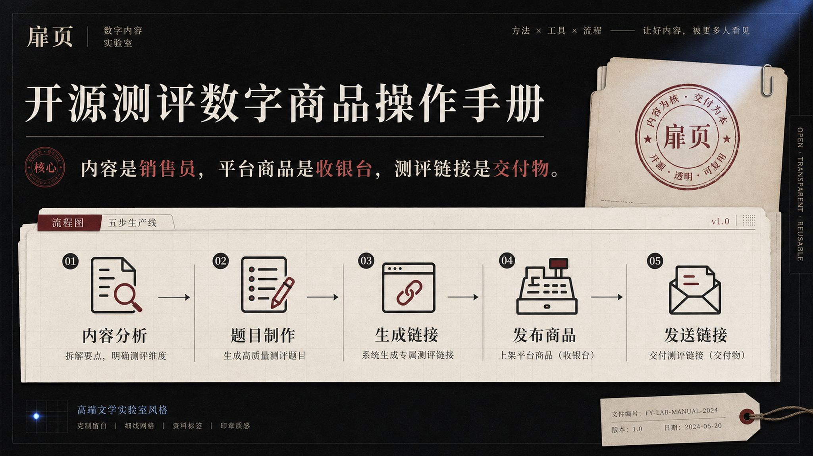

# 扉页 · Open Quiz Business Playbook

> 内容是销售员，平台商品是收银台，测评链接是交付物，结果页面是消费体验。

**在线体验：<https://pjbian1.github.io/feiye/>**

扉页免费开源一套可以复刻的自营测评数字商品方法：从内容平台发现一个“有人想测”的主题，用 AI 制作题目和结果，生成测评链接，发布商品，买家付款后发送链接，交付完成。

项目本身不靠这套方法收费；它公开的是经营者如何制作、销售并交付自己的测评商品。案例只证明生产与交付链路可以跑通，不代表需求、销量或利润。



  

## 七步最小闭环

```text
看需求 → 定商品 → 做题目 → 生成链接 → 发布内容 → 用户购买 → 发送链接
```

第一版刻意不接支付、不做账号、订单系统、一客一码和防转发。平台完成交易，经营者发送完整链接，买家能够打开、答题并查看结果，本次交付就已经结束。

完整商业模式与逐步操作见 [`playbook/README.md`](playbook/README.md)。

## 网站包含什么

- 需求、供给、连接、交易与链接交付的完整商业地图；
- 内容分析、题目制作、建站、销售交付四个工作台；
- 选题卡、销售内容、商品说明、交付话术、首单检查表和经营记录表；
- 三套手写馆藏：《你的文学原型》《你的灵魂执笔人》《你的古典魂魄》；
- 一屏一题、进度显示、回退重选、主原型与次要底色；
- 原生 Canvas 生成 1080 × 1440 PNG 藏书票结果卡；
- 支持系统分享、测评链接、个人结果链接与重新测试；
- 支持粘贴 JSON、上传 `.json`、中文格式错误和评分覆盖检查；
- 自建测试经 deflate 压缩后编码进 URL hash，不上传数据库；
- 完整公开 AI 出题提示词、JSON 规范、建站方法与可安装 Skill；
- 纯静态 HTML/CSS/JS，无构建、无依赖、无 Cookie、无统计。

## 从第一件商品开始

1. 用 [`playbook/templates/01-topic-card.md`](playbook/templates/01-topic-card.md) 记录至少十条外部需求证据；
2. 在网站“题目制作”页面复制提示词，让 AI 输出标准 JSON；
3. 在“建站工作台”导入 JSON，校验并生成完整商品链接；
4. 使用 [`playbook/templates/02-sales-note.md`](playbook/templates/02-sales-note.md) 和 [`playbook/templates/03-product-listing.md`](playbook/templates/03-product-listing.md) 准备平台内容与商品说明；
5. 买家完成平台订单后，用 [`playbook/templates/04-delivery-message.md`](playbook/templates/04-delivery-message.md) 发送链接；
6. 用 [`playbook/templates/06-review-sheet.csv`](playbook/templates/06-review-sheet.csv) 记录经营数据，不收集买家答题隐私。

## 本地运行

```bash
git clone https://github.com/PJBian1/feiye.git
cd feiye
python3 -m http.server 8000
# 打开 http://localhost:8000
```

也可以直接打开 `index.html`。压缩链接、剪贴板等能力在 HTTP/HTTPS 环境下兼容性更好。

## 让 AI 替你出题

普通创作者直接阅读 [`skill/doubao-skill.md`](skill/doubao-skill.md)，复制提示词发给豆包、DeepSeek、Kimi、元宝、ChatGPT 等任意 AI。

Codex 或其他 Agent 可以安装 [`skill/create-feiye-quiz`](skill/create-feiye-quiz/SKILL.md)。正式 Skill 包含：

- 简洁的出题工作流；
- [`references/schema.md`](skill/create-feiye-quiz/references/schema.md) 字段与内容规范；
- [`scripts/validate_quiz.mjs`](skill/create-feiye-quiz/scripts/validate_quiz.mjs) 确定性校验与分享链接生成。

校验一份题目：

```bash
node skill/create-feiye-quiz/scripts/validate_quiz.mjs quiz.json
```

校验并直接生成分享链接：

```bash
node skill/create-feiye-quiz/scripts/validate_quiz.mjs quiz.json \
  --share-url https://pjbian1.github.io/feiye/
```

## JSON 最小结构

```json
{
  "title": "测试标题",
  "subtitle": "一句副标题",
  "tag": "分类 · 十题",
  "desc": "开场白",
  "questions": [
    {
      "q": "题干",
      "options": [
        { "text": "选项", "scores": { "key1": 2, "key2": 1 } }
      ]
    }
  ],
  "results": {
    "key1": {
      "name": "原型名",
      "source": "出处",
      "quote": "真实引文或空字符串",
      "desc": "解读",
      "traits": ["词一", "词二", "词三"],
      "hue": 200
    }
  }
}
```

计分方式：每个选项把权重累加到对应结果，最高分是主原型，第二名是次要底色。同分时按 `results` 中的顺序稳定决胜。

## 链接就是第一版交付物

自建测试的分享过程：

```text
JSON → UTF-8 → deflate-raw → base64url → URL hash
```

浏览器不会把 `#` 后面的 hash 发送给服务器，因此网站无法读取或存储用户的自建题目与答案。代价是链接较长、可以被转发，也无法在服务器端统一编辑或删除。第一版接受这些损耗，先验证“做出来—卖出去—发链接”能否形成真实闭环。

## 部署自己的版本

1. Fork 本仓库；
2. 修改 `index.html` 的站点信息；
3. 修改 `assets/app.js` 顶部的 `REPO_URL`；
4. 在 `assets/presets.js` 增删馆藏；
5. GitHub 仓库进入 Settings → Pages → Deploy from a branch → `main` / `/ (root)`。

完整解释也公开在网站的“开源”页面：<https://pjbian1.github.io/feiye/#/opensource>。

## 目录

```text
feiye/
├── index.html
├── assets/
│   ├── app.js
│   ├── presets.js
│   ├── style.css
│   ├── og-v3.png
│   └── og-source.json
├── skill/
│   ├── doubao-skill.md
│   └── create-feiye-quiz/
│       ├── SKILL.md
│       ├── agents/openai.yaml
│       ├── references/schema.md
│       └── scripts/validate_quiz.mjs
├── playbook/
│   ├── README.md
│   ├── case-literary-archetype.md
│   └── templates/
│       ├── 01-topic-card.md
│       ├── 02-sales-note.md
│       ├── 03-product-listing.md
│       ├── 04-delivery-message.md
│       ├── 05-first-sale-checklist.md
│       └── 06-review-sheet.csv
├── examples/deep-night-cafe.json
├── LICENSE
└── README.md
```

## 安全与隐私

- 所有用户内容在渲染前进行 HTML 转义；
- JSON 限制为 40KB、50 道题、24 个结果；
- 不使用登录、Cookie、广告、统计脚本或外部字体；
- 文学引文仍需人工核实，提示词明确要求“不确定就留空”；
- 这是一项娱乐与自我表达产品，不提供心理、医学或命运诊断。
- 平台规则会变化，经营者必须在发布前自行核对当期商品、宣传、交付与售后规则；
- 本项目不承诺收入、销量、转化率或利润。

## License

[MIT](LICENSE) · 欢迎 Fork、二创与商用。
